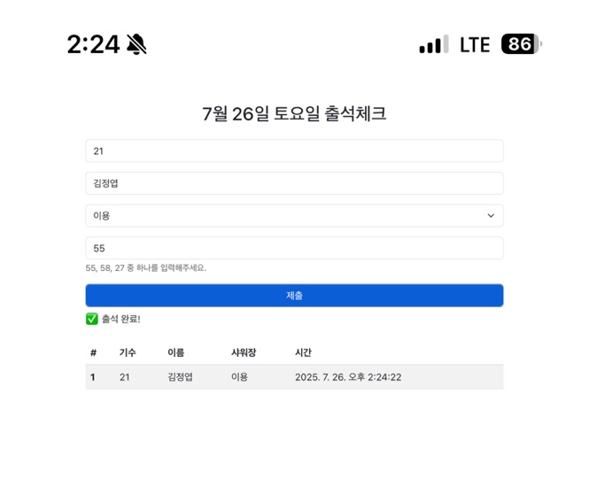
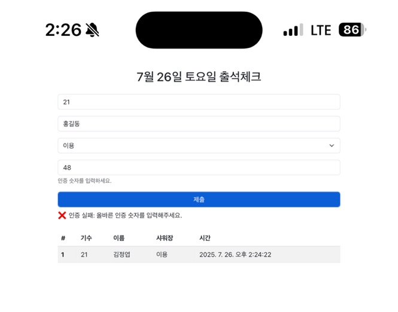
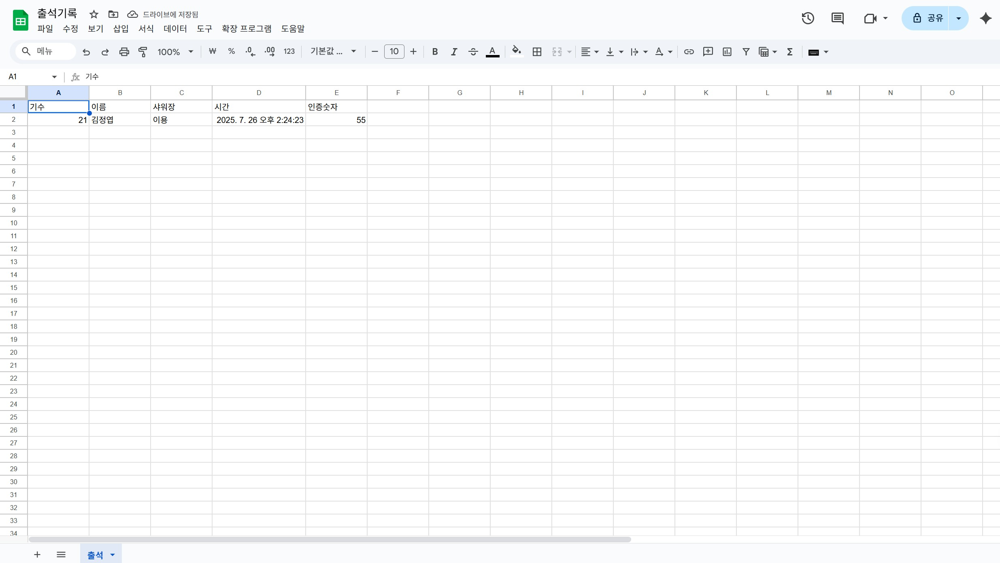
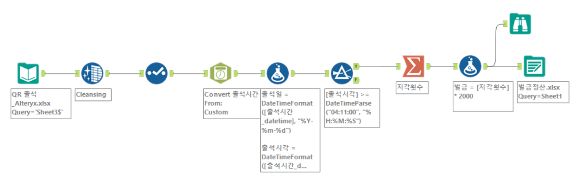

# QR-attendance-system

스쿼시 동아리 QR 출석 자동화 및 벌금 정산 시스템

## 📁 폴더 구조
QR-attendance-system/
├ code/
│   ├ Code.gs      # Google Apps Script 서버 로직
│   └ index.html   # 사용자 UI 화면
├── screenshots/
│   ├── success.png
│   ├── fail.png
│   ├── table.png
│   └── alteryx-workflow.png
└ README.md        # 프로젝트 설명

## ✨ 주요 기능
- QR 기반 인증 코드 자동 생성 및 검증  
- Google Sheets (`출석` 시트) 연동 출석 기록  
- `getAttendance()`로 오늘자 출석만 필터링   
- 중복 출석 방지 및 코드 일치 여부 검증
- 실시간 출석 현황 테이블 표시 (index.html 내 포함)

## ⚙️ 설치 및 실행 방법
1. 스프레드시트 준비  
   - 새 Google 스프레드시트 생성  
   - 시트명: `출석`  
   - 1행(헤더): `기수` | `이름` | `샤워장` | `시간` | `코드`  
2. Apps Script 업로드  
   - [script.google.com](https://script.google.com) → 새 프로젝트  
   - `Code.gs`, `index.html` 파일을 각각 붙여넣기  
   - 상단 `SPREADSHEET_ID` 변수에 스프레드시트 ID 입력  
3. 웹앱으로 배포  
   - Deploy → New deployment → Web app  
   - 접근 권한: `Anyone`  
   - 배포 후 생성된 URL 복사  
4. 실행  
   - 복사한 웹앱 URL 접속 → 즉시 출석폼·실시간 테이블 확인  
   - 기수·이름·샤워장·인증코드 입력 → 출석 처리 결과 확인  
   - 하단 테이블에서 오늘자 출석 현황 실시간 확인

## 📄 화면 예시

### ✅ ① 인증 성공 화면

> 사용자가 기수, 이름, 샤워장 이용 여부, 인증 코드를 올바르게 입력하면 `✅ 출석 완료!` 메시지가 표시되고, 아래 테이블에 자동으로 반영됩니다.

---

### ❌ ② 인증 실패 화면

> 인증 코드가 오늘의 코드와 일치하지 않을 경우, `❌ 인증 실패` 메시지가 뜨며 출석은 저장되지 않습니다.

---

### 📊 ③ 실시간 출석 현황 테이블

> 오늘 출석한 인원이 테이블에 실시간으로 표시되며, 새로고침 없이 10초마다 자동으로 갱신됩니다.

## 🧩 코드 구조

| 이름 / 함수명                       | 역할 |
|-----------------------------------|------|
| `doGet()`                         | 웹앱 진입점으로 `index.html` 반환 |
| `checkAttendance(gen, name, shower, code)` | 사용자 입력 검증, 인증코드 확인 후 출석 저장 |
| `getTodayCode()`                  | 오늘의 인증코드 자동 생성 또는 ScriptProperties에서 조회 |
| `getAttendance()`                 | 시트의 전체 데이터 중 오늘 날짜에 해당하는 출석 내역 필터링 |
| `generateRandomCodes()`           | 1~100 중 중복 없는 3개의 무작위 숫자 생성 |
| `SPREADSHEET_ID`                  | 연결된 Google 스프레드시트 ID 상수 |
| `TIMEZONE`, `DATE_FORMAT`         | 날짜 비교 기준 설정 (`Asia/Seoul`, `yyyy-MM-dd`) |
| `ScriptProperties` (내부 key: `codes_`, `selected_`) | 인증코드 상태를 날짜별로 저장/조회하는 키-값 저장소 |
| `submitForm()` (index.html)       | 입력된 사용자 데이터를 `checkAttendance()`로 전송 |
| `loadTable()` (index.html)        | `getAttendance()` 호출 후 출석 현황 테이블에 표시 |
| `fetchTodayCodes()` (index.html)  | 오늘의 인증코드를 `getTodayCode()`로 받아와 힌트 표시 |

---

## 💻 기술 스택

- **Google Apps Script (Code.gs)**  
  - 백엔드 로직, Google Sheets 연동  
  - `ScriptProperties`로 인증 상태 보존  
  - 서버-클라이언트 간 함수 연동 (`google.script.run`)
  
- **HTML / CSS / JavaScript**  
  - 사용자 입력폼, 결과 메시지, 동적 테이블 UI 구현  
  - `submitForm()`, `loadTable()` 등 클라이언트 로직 포함

- **Bootstrap 5**  
  - 반응형 UI 구성 (폼, 버튼, 테이블 스타일링 등)

- **ScriptProperties (내장 서비스)**  
  - 인증코드 및 사용 상태를 날짜별로 저장 (재사용 가능하게)

- **Git + GitHub**  
  - 코드 버전 관리 및 포트폴리오 배포용 저장소 운영

---

## 🤖 AI 도구

- **ChatGPT (OpenAI)**  
  - 인증 구조 설계 및 로직 검증 (e.g. 랜덤 인증코드 vs 고정코드 비교 방식)  
  - 날짜 파싱 오류 해결 및 `getAttendance()` 개선  
  - UI 흐름 중심의 README 구성 및 시나리오 정리  
  - GAS 오류 디버깅 (e.g. `Date` 객체 파싱, `null` 원인 추적 등)  
  - 코드 자동화 및 사용자 중심 기능 설명에 활용

## 🔄 향후 확장 계획: 벌금 정산 자동화 (with Alteryx)

현재 시스템은 QR 기반 출석체크와 실시간 현황 표시까지 자동화되어 있습니다.  
여기서 더 나아가, **출석 데이터를 바탕으로 벌금 정산을 자동화하는 Alteryx 워크플로우**도 구축 중입니다.

---

### 🧩 Alteryx 워크플로우 개요

> 위 워크플로우는 `QR 출석_Alteryx.xlsx` 파일을 불러와 다음과 같은 과정을 자동으로 처리합니다:

1. **출석 시간 정제 및 변환**
   - 출석 시간 형식 표준화 (`datetime`, `시간만 분리`)
2. **지각 여부 판별**
   - 기준 시각인 `오전 4시 11분` 이후 도착 시 → `지각 1회`
3. **기수별 지각 횟수 합산**
   - `Summarize` 도구를 통해 기수/이름별 지각 누적 집계
4. **벌금 계산**
   - 지각 횟수 × 2,000원 자동 계산
5. **정산 결과 출력**
   - 결과는 `벌금정산.xlsx`로 자동 저장됨

---

### 🎯 향후 목표

- `출석 시트(Google Sheets)`와 Alteryx 워크플로우 간 연동 자동화
- 정기적으로 `.csv` 내보내기 or API 연동으로 자동 정산 갱신
- 누적 벌금 통계 대시보드화 (추후 Power BI 연계 가능성 검토)

---

### 💡 기대 효과

- **지각자 벌금 산정 기준 일관화**
- **실시간 출석 → 정기 정산까지 한 번에 연결**
- **관리자 개입 없이도 회계 투명성 확보**

