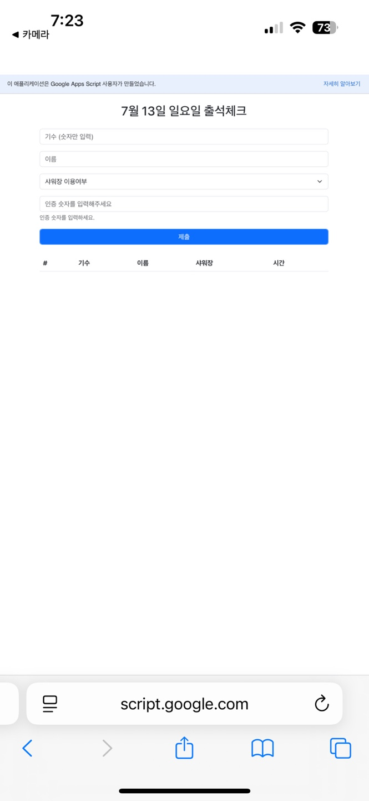

# QR-attendance-system

스쿼시 동아리 QR 출석 자동화 및 벌금 정산 시스템

## 📁 폴더 구조
QR-attendance-system/
├ code/
│ ├ Code.gs # Google Apps Script 서버 로직
│ └ index.html # 사용자 UI 화면
└ README.md # 프로젝트 설명

## ✨ 주요 기능
- QR 기반 인증 코드 자동 생성 및 검증  
- Google Sheets (`출석` 시트) 연동 출석 기록  
- `getAttendance()`로 오늘자 출석만 필터링   

## ⚙️ 설치 및 실행 방법
1. 스프레드시트 준비  
   - 새 Google 스프레드시트 생성  
   - 시트명: `출석`  
   - 1행(헤더): `기수` | `이름` | `샤워장` | `시간` | `코드`  
2. Apps Script 업로드  
   - [script.google.com](https://script.google.com) → 새 프로젝트  
   - `Code.gs`, `index.html` 파일을 각각 붙여넣기  
   - 상단 `SPREADSHEET_ID` 변수에 스프레드시트 ID 입력  
3. 웹앱으로 배포  
   - Deploy → New deployment → Web app  
   - 접근 권한: `Anyone`  
   - 배포 후 생성된 URL 복사  
4. 실행  
   - 복사한 웹앱 URL 접속 → 즉시 출석폼·실시간 테이블 확인  

## 🧪 사용 예시
1. 사용자 입력:  
   - 기수, 이름, 샤워장 이용 여부, 인증 번호  

## 📄 화면 예시

## 🧩 코드 구조
| 함수명                    | 역할                                     |
|---------------------------|------------------------------------------|
| `doGet()`                 | 웹앱 진입점, `index.html` 반환           |
| `checkAttendance(gen, ...)` | 출석 등록 및 인증 로직                    |
| `getTodayCode()`          | 오늘의 인증 코드 조회(자동 생성 포함)    |
| `getAttendance()`         | 오늘자 출석만 필터링하여 전체 반환       |
| `generateRandomCodes()`   | 1~100 중 무작위 3개 코드 생성           |

## 💻 기술 스택
- Google Apps Script (Code.gs)
- HTML/CSS/JavaScript + Bootstrap 5
- Git + GitHub

## 🤖 AI 도구
- ChatGPT (OpenAI): 코드 보조 및 아이디어 생성
